## 🛠️ Projet ENI 02 – Java Spring – Site d’enchères / troc

### 🚀 Technologies utilisées
- HTML  
- CSS  
- JavaScript  
- Java (Spring, Spring Boot, Spring Security)  
- SQL Server  
- Thymeleaf  

### 📝 Description

Ce projet est le **deuxième réalisé en autonomie**, sur un peu moins de deux semaines, dans le cadre de ma formation à l'ENI.

L’objectif était de développer une partie d’un site d’enchères et de troc entre particuliers.

#### ✅ Fonctionnalités développées (toutes fonctionnelles avec persistance en base de données) :
- Affichage des annonces et fiches produits  
- Recherche par nom et par catégorie  
- Authentification via Spring Security  
- Inscription / création de profil  
- Filtres supplémentaires pour les membres connectés :  
  - Enchères ouvertes  
  - Mes enchères en cours  
  - Mes enchères remportées  
  - Mes ventes en cours, non débutées, terminées  
- Affichage détaillé des profils  
- Modification du profil connecté  
- Mise en vente d’un article (avec description, prix, dates de vente – **sans upload de photo**)  

#### ❌ Fonctionnalités non implémentées (faute de temps) :
- Upload de photos d’articles  
- Pagination des annonces  
- Gestion de la fin des enchères  
- Feedbacks utilisateur (ex. : messages de confirmation, erreurs, etc.)

---

### 🔍 Aperçu

#### 📐 Wireframes fournis (pas de maquettes graphiques)
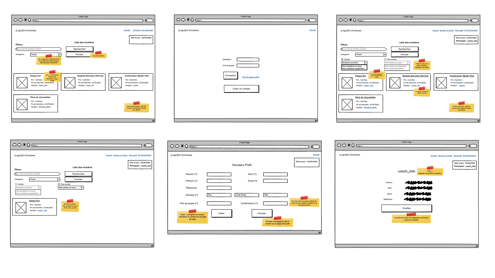

---

#### 🏠 Page d'accueil – non connecté
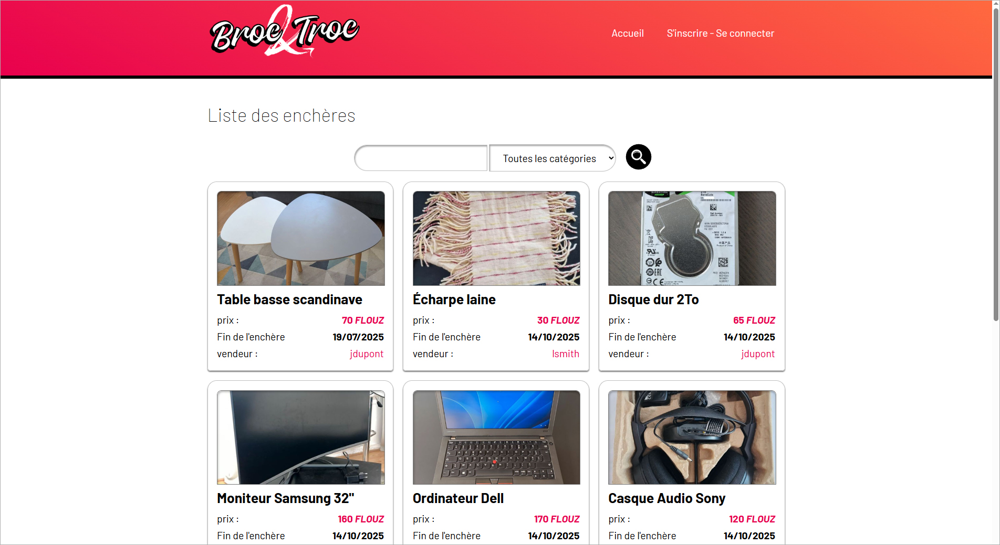

Effet *rollover* et accès aux fiches  
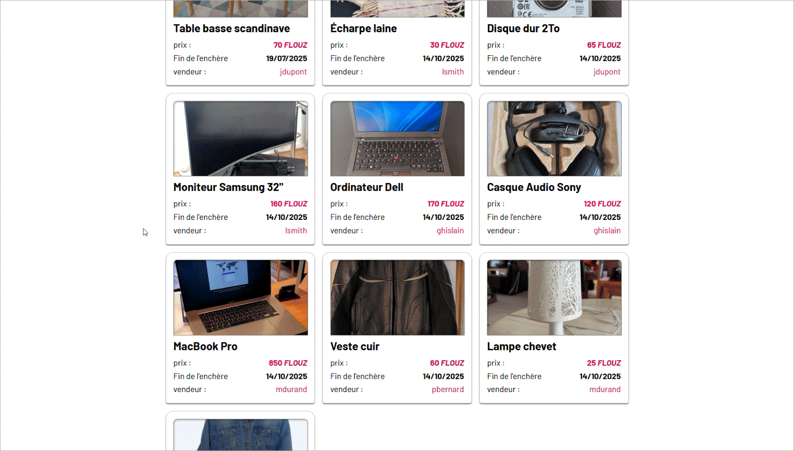

---

#### 🛒 Détail d’un article
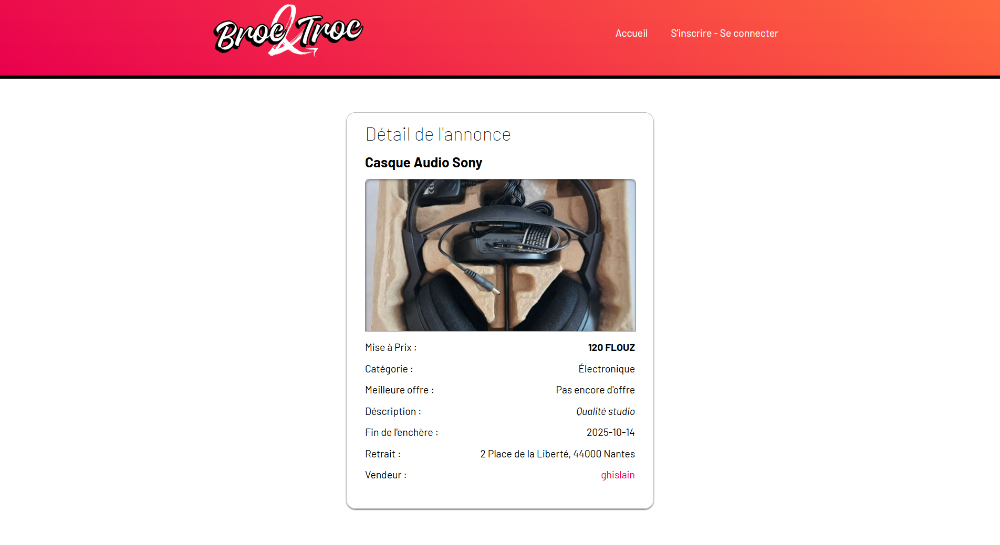

#### 🔐 Écran de connexion
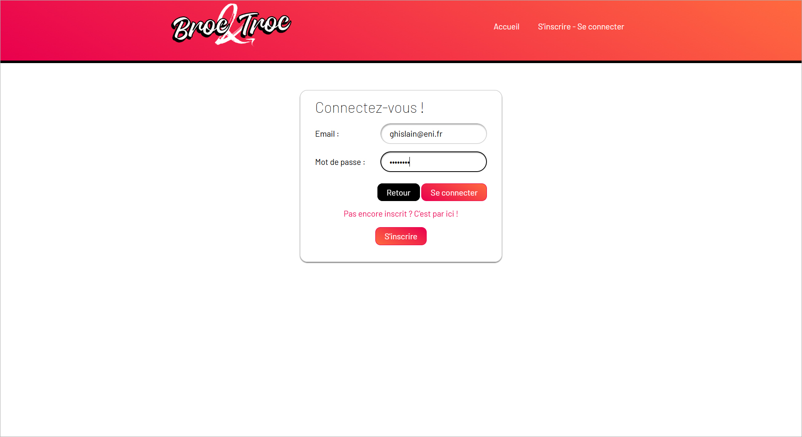

#### 🧾 Création d’un profil
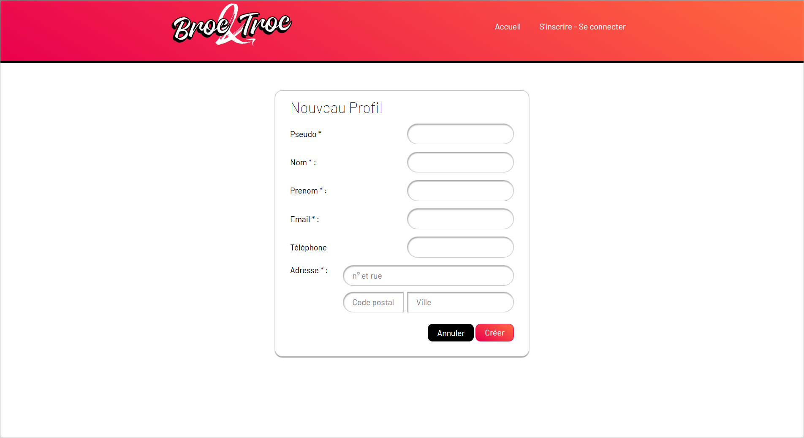

#### 🔎 Accueil connecté – avec filtres supplémentaires
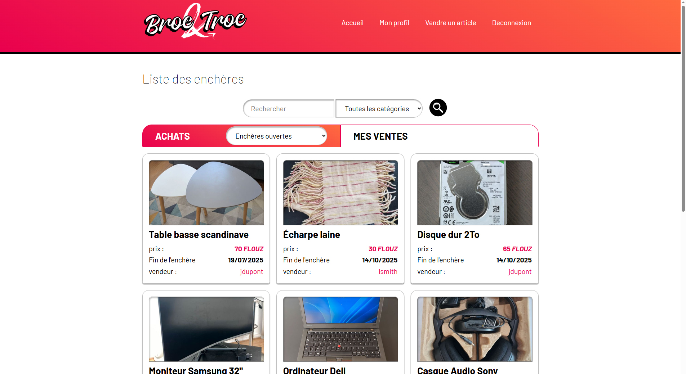  
  
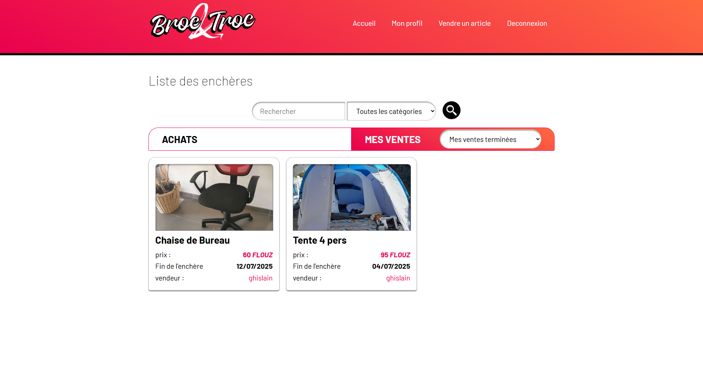  
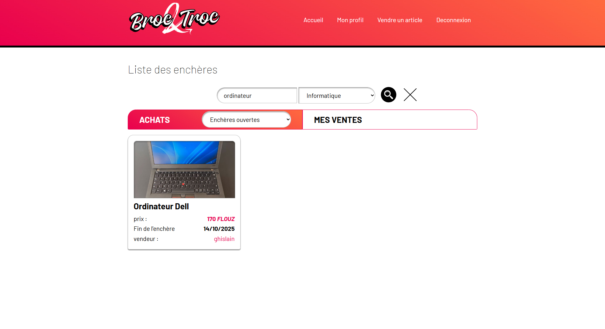

#### 📄 Détail du profil
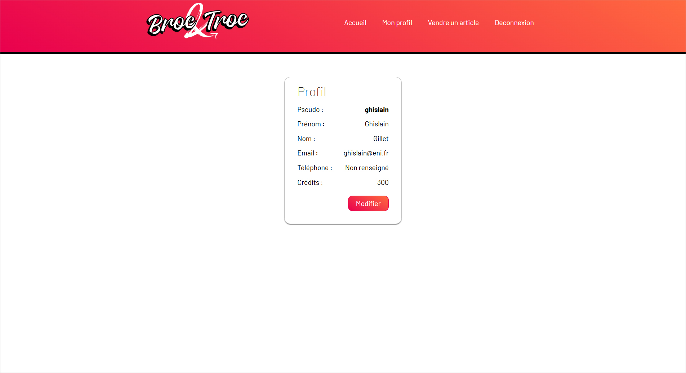

#### ✏️ Modification du profil
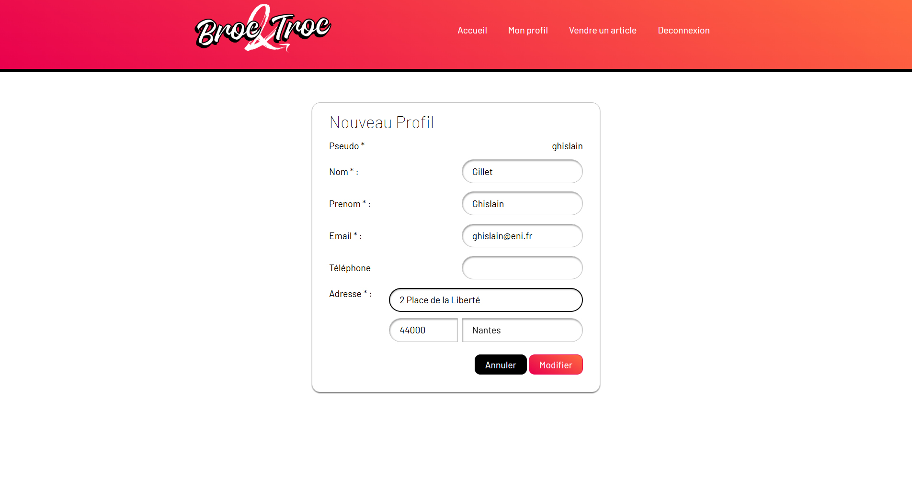

#### 📦 Mise en vente d’un article
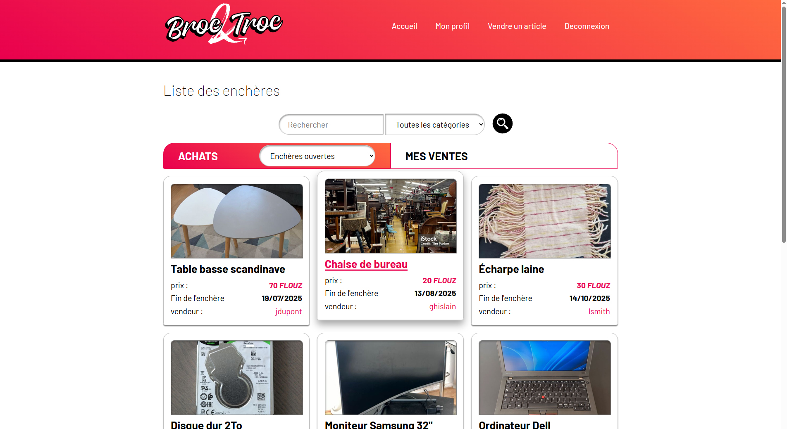

---

### 👨‍💻 Auteur  
**Ghislain Gillet** – Développeur Full Stack en reconversion  
🔗 [Mon profil LinkedIn](https://www.linkedin.com/in/ghislain-gillet44)
